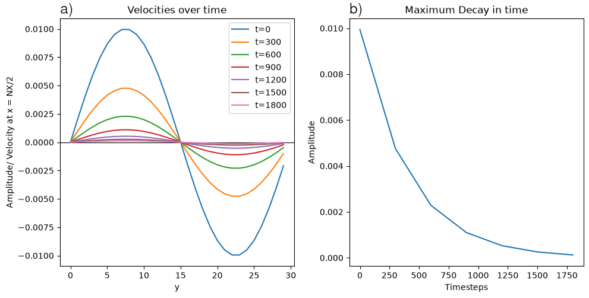
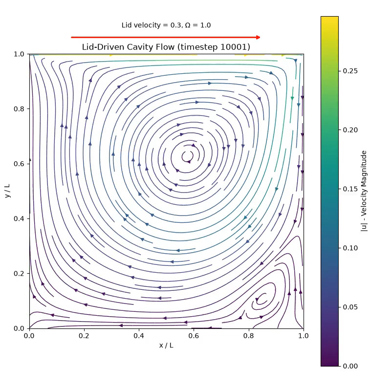
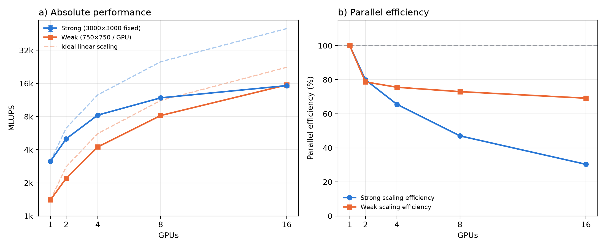
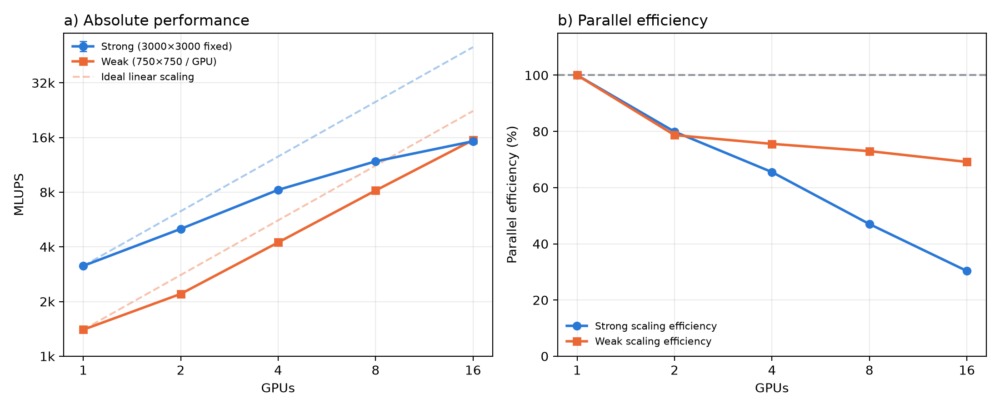

<!-- _class: title -->
<!-- _paginate: false -->
<!-- _footer: "" -->

## A GPU-Accelerated Lattice Boltzmann Solver

#### D2Q9 with Kokkos and MPI

###### Julius Fischer · 2026-08-26
HPC with Accelerators

---
<!-- paginate: true -->

# Roadmap: Lattice Boltzmann
- Our goal is a fluid simulation

1. Streaming
- Makes the fluid move
2. Boundary Conditions / Bounce-back & Wrap-Around
- Lets the fluid interact with its container
3. Collision
- 'Adds the physics' to the simulation

---
<!-- _paginate: true -->
# Discretization
- D2Q9 - 2 Dimensions, 9 Directions/ Channels
- Data structure: `Kokkos::View` 
- Agnostic to hardware: CPU / GPU

```
typedef Kokkos::View<double***>     DISTRIB;
typedef Kokkos::View<double**>      DENSITY; 
typedef Kokkos::View<double**[2]>   VELOCITY;
```

---
<!-- _paginate: true -->
# Algorithm: Streaming & Boundary Conditions
<!-- footer: MILESTONE 02–03 -->

- Simple for loop:
    - For every value: *push* it in its direction 
- Streaming directly contains wrap around logic
    - Branchless Implementation
- For Bounce back:
    - Simulate streaming on additional (ghost) layer
    - Flip afterwards

---
<!-- _paginate: true -->
<!-- footer: MILESTONE 04 -->
# Algorithm: Collision
- For loops to calculate
    - density & average velocity
    - collision updates for distribution
- Fused into one kernel/ for loop for performance
---

<!-- footer: MILESTONE 04 -->
# Shear Wave Validation
- Simple initialization of epsilon using `Kokkos::sin`


--- 

<!-- footer: MILESTONE 05 -->
# [Moving Lid](./img/moving_lid.mp4)
- For the lid: 
   Adjust bounce back calculations


---
# MPI Implementation
<!-- footer: MILESTONE 06 -->
- Divide the Boltzmann Lattice Simulation into sublattices via MPI
- Specific Implementation of MPI just for Milestone 6
- Shift over into ghost buffers (Left & Right -> Up & Down)
- Communicate ghost buffers via `MPI_Sendrecv` & `Kokkos::deep_copy`
---

# Scaling


---

# Logarithmic Scaling


---
<!-- footer:  ""-->
# Conclusion & Takeaways

- Impressively 'easy' to implement
    - Fluid Simulation
    - Code for GPU
- Verify your tests
- Take inspiration from other people
