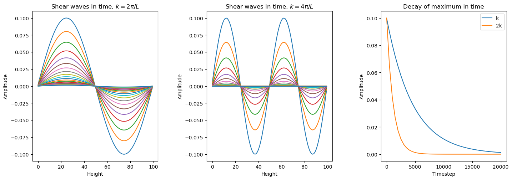
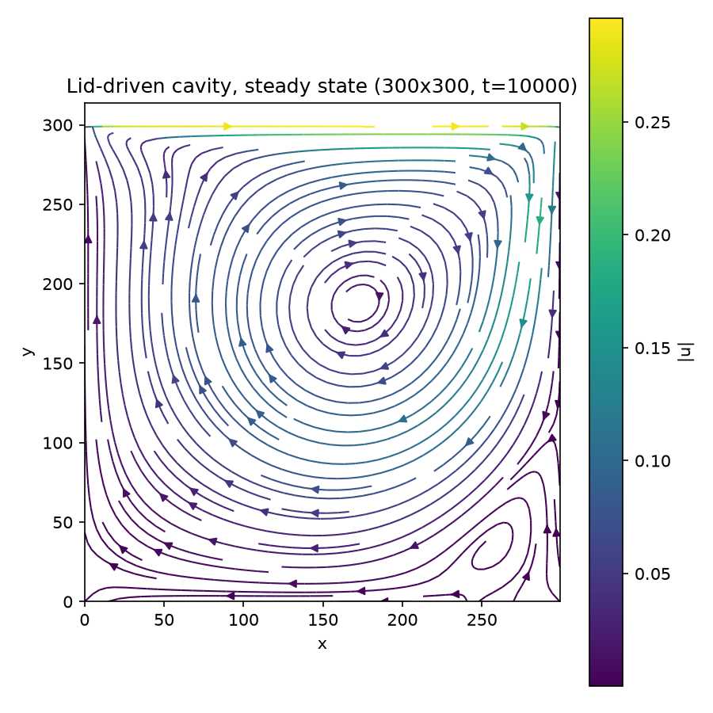

<!-- _class: title -->
<!-- _paginate: false -->
<!-- _footer: "" -->

# A GPU-Accelerated Lattice Boltzmann Solver

### D2Q9, Kokkos, and distributed-memory MPI

<br>

**Julius Fischer**
HPC with Accelerators — Colloquium, Summer 2026

---

## What is Lattice Boltzmann?

<div class="grid2">
<div>

- Simulates fluid flow by tracking **particle distribution functions** $f_i(\mathbf{x}, t)$ on a fixed lattice, instead of solving Navier–Stokes directly
- Each timestep: particles **stream** along lattice directions, then **collide** toward local equilibrium
- Macroscopic $\rho$, $\mathbf{u}$ recovered as moments of $f_i$
- **Local, data-parallel** → great fit for GPUs + MPI

</div>
<div class="center">

**D2Q9 lattice** — 9 velocity directions

<div class="d2q9">
<div>↖</div><div>↑</div><div>↗</div>
<div>←</div><div class="center-cell">●</div><div>→</div>
<div>↙</div><div>↓</div><div>↘</div>
</div>

weights: $\tfrac{4}{9}$ (rest), $\tfrac{1}{9}$ (axes), $\tfrac{1}{36}$ (diag.)

</div>
</div>

---

## Algorithm: Stream → Collide → Bounce-back

Every timestep, for every lattice node:

1. **Streaming** — propagate $f_i$ to the neighbor along direction $i$
2. **Bounce-back** — enforce solid-wall / moving-lid boundaries
3. **Collision (BGK)** — relax toward equilibrium:

$$
f_i(\mathbf{x}, t+1) = f_i(\mathbf{x}, t) + \omega\left[f_i^{eq}(\mathbf{x},t) - f_i(\mathbf{x},t)\right]
$$

$$
f_i^{eq} = w_i \, \rho \left(1 + 3\,\mathbf{e}_i\!\cdot\!\mathbf{u} + \tfrac{9}{2}(\mathbf{e}_i\!\cdot\!\mathbf{u})^2 - \tfrac{3}{2}|\mathbf{u}|^2\right)
$$

Kinematic viscosity is set entirely by the relaxation rate: $\;\nu = \frac{1}{3}\left(\frac{1}{\omega} - \frac{1}{2}\right)$

<p class="small">Implemented in <code>src/boltzman.cpp</code>: <code>streaming()</code>, <code>bounce_back()</code>, <code>collision()</code> / <code>calc_feq()</code> in <code>src/direction.hpp</code>.</p>

---

## Kokkos-based implementation

<div class="grid2">
<div>

- `BoltzmanLattice` owns state as **Kokkos Views**: `distribution`, `buffer` (double-buffered stream target), `density`, `avg_velocity`
- Every update is a `Kokkos::parallel_for` over an `MDRangePolicy` — same source compiles to OpenMP (CPU) or CUDA (GPU)
- **`collision_fused()`**: density, velocity, $f^{eq}$, BGK relaxation in *one* kernel instead of four — fewer global-memory round-trips

</div>
<div>

```cpp
Kokkos::parallel_for(
  "CollisionFused", all_nodes_policy(),
  KOKKOS_LAMBDA (const int &x, const int &y) {
    // load f_i, reduce -> rho, u
    // build f_i^eq, relax, write back
    // all in registers, one pass
});
```

<p class="small">
Build: <code>cmake -B build-cuda -DYALB_ENABLE_CUDA=ON
-DKokkos_ARCH_&lt;GPU&gt;=ON</code>, same <code>src/</code> for CPU and GPU targets.
</p>

</div>
</div>

---

## Correctness by construction

Before trusting performance numbers, the solver has to be *right*.

**Unit tests** (`tests/test_milestone03.cpp`, GoogleTest, run via `ctest`):

| Test | What it checks |
|---|---|
| `MassConservation` | $\sum_i f_i$ summed over the whole lattice is invariant across 100 stream+collide steps on a randomized initial distribution |
| `MomentumConservation` | Total momentum $\sum \mathbf{e}_i f_i$ is likewise invariant |

Both pass to within `1e-5` — the discrete Boltzmann update conserves mass and momentum exactly, as the continuous equations require.

---

## Validation: shear-wave decay

<div class="grid2">
<div>

- Initialize a sinusoidal velocity perturbation $u_x(y) = \varepsilon \sin(ky)$, no forcing, and let it decay
- Analytically, the amplitude decays as $e^{-\nu k^2 t}$ — a direct, independent measurement of the solver's viscosity
- Measured decay of the simulated amplitude (right panel, two wavenumbers $k$ and $2k$) matches the analytic prediction from $\omega$

</div>
<div class="center">



</div>
</div>

<p class="small">Milestone 04 · <code>shear_wave_init()</code> in <code>src/boltzman.cpp</code></p>

---

## Validation: lid-driven cavity

<div class="grid2">
<div>

- Classic LBM benchmark: no-slip walls on 3 sides (bounce-back), moving lid on top
- $300\times300$ grid, $Re = \dfrac{u_{lid} L}{\nu} \approx 540$, steady state by $t=10{,}000$
- Reproduces the expected topology: **primary vortex** at center + **secondary corner vortex** — only appears once solver & BCs are correct

</div>
<div class="center">



</div>
</div>

<p class="small">Milestone 05 · <code>bounce_back()</code>: no-slip + moving-lid BCs, <code>src/boltzman.cpp</code></p>

---

## Scaling out: MPI domain decomposition

<div class="grid2">
<div>

- 2D **Cartesian rank topology**: `MPI_Dims_create` + `MPI_Cart_create`; each rank owns a `size_x/dims[0] × size_y/dims[1]` sub-lattice
- 1-cell **ghost layer** exchanged with all 4 neighbors every step via `MPI_Cart_shift` + `MPI_Sendrecv`
- Boundary slices packed/unpacked by a Kokkos kernel into small staging buffers (a fixed-index slice of the distribution view is non-contiguous under GPU layout)

</div>
<div>

<div class="mpigrid">
<div class="rank">rank 0</div><div class="arrow">↔</div><div class="rank">rank 1</div><div class="arrow">↔</div><div class="rank">rank 2</div>
<div class="arrow">↕</div><div></div><div class="arrow">↕</div><div></div><div class="arrow">↕</div>
<div class="rank">rank 3</div><div class="arrow">↔</div><div class="rank">rank 4</div><div class="arrow">↔</div><div class="rank">rank 5</div>
</div>

<p class="small">1-cell halo exchanged with all 4 neighbors, every step.</p>

<p class="small"><b>One rank per GPU.</b> Staging buffers allocated <i>once</i>, reused every step — an earlier version re-allocated 8 device views per exchange (~160k <code>cudaMalloc</code>/<code>cudaFree</code> pairs over a 10k-step run), capping scaling.</p>

</div>
</div>

---

## Performance & scaling

- Metric: **MLUPS** — Million Lattice Updates/s $= \dfrac{X \cdot Y \cdot N_{steps}}{t_{run}\times 10^6}$

<div class="center">

| Grid | Timesteps | Runtime | GPUs | **MLUPS** |
|---|---|---|---|---|
| $3000\times3000$ | 10,000 | 8.28 s | 12 (3 nodes × 4 A100) | **495.4** |

</div>

- `scaling_tests.jobs` sweeps **strong scaling** (fixed $3000^2$, GPUs $\in\{1,2,4,8,16\}$) and **weak scaling** (constant $750^2$/GPU, same counts)

<div class="placeholder center">
Scaling sweep queued but not yet completed on the cluster — strong/weak scaling plots go here once scaling_tests.jobs finishes running.
</div>

<p class="small">Expected: near-linear weak scaling (halo is thin relative to a 750×750 subdomain); strong scaling rolls off once per-GPU work drops below what's needed to hide ghost-exchange latency.</p>

---

## Summary & outlook

**What's built:** a D2Q9 Kokkos solver — streaming, BGK collision, bounce-back / moving-lid BCs — validated by conservation tests and shear-wave decay, distributed with MPI Cartesian ghost exchange, one rank per GPU.

**What it does correctly:** mass & momentum conservation to $10^{-5}$; measured viscosity matches shear-wave theory; lid-driven cavity reproduces the expected primary + secondary vortex topology.

**Measured so far:** 495 MLUPS on 12 A100 GPUs at $3000^2$.

**Next:** finish the strong/weak scaling sweep; profile the ghost-exchange vs. compute overlap at high rank counts.

### Questions?
